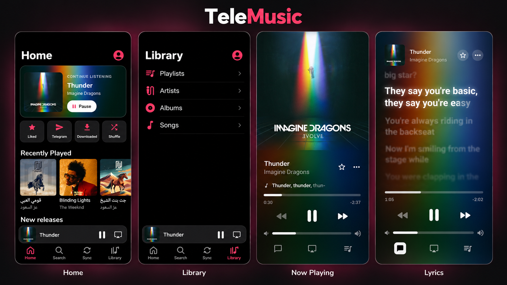

# TeleMusic 🎵

  <strong>Turn your own private Telegram channel into a full music library</strong> 
  Built with Jetpack Compose and Material Design 3

  
  
  

---

  

---

## ✨ Features

- **Telegram library** — sync music from your channels and chats.
- **YouTube Music** — sign in for your personalized Home feed; search, discover, stream and download songs.
- **Spotify & local imports** — import playlists, albums or audio files from your phone.
- **Personal Home** — Continue Listening, Recently Played, mixes and community playlists. Settings → Home Feeds lets you enable the Telegram/library and YouTube feeds independently.
- **Organised library** — songs, albums, artists and playlists, with automatic metadata and artwork.
- **Offline listening** — download favourites and manage your streaming cache.
- **Synced lyrics** — follow lyrics line by line or word by word when available.
- **Now Playing** — full-cover artwork, animated backgrounds and an expandable mini player.
- **Dark & light themes** — choose Dark, Light or follow your system.
- **Playback controls** — background playback, home-screen widgets, Bluetooth and Android Auto.

---

## 🛠️ Tech Stack

| Category | Technology |
|---|---|
| **Language** | Kotlin |
| **UI** | Jetpack Compose + Material 3 |
| **Playback** | Media3 (ExoPlayer + MediaSession) |
| **Telegram** | [TDLib](https://github.com/tdlib/td) |
| **Database** | Room |
| **Networking** | Retrofit + OkHttp |
| **Images** | Coil |
| **Async** | Coroutines + Flow |

---

## 🚀 Getting Started

1. Get a free `api_id`/`api_hash` from [my.telegram.org](https://my.telegram.org) → API Development Tools
2. Clone and open in Android Studio, let Gradle sync, then run
3. Open Settings → Accounts → Telegram, enter your credentials, sign in, and pick the channel to sync.
4. YouTube Music and Spotify sign in from the same Accounts card. Favorites remain local to TeleMusic.

Requires Android 8.0 (API 26) or newer.

---
community support 
https://t.me/telemusicco
---

## 📄 License

Copyright (c) 2026 abn3li.

TeleMusic's original code is free software: you can redistribute it and/or modify it under the terms of the GNU General Public License as published by the Free Software Foundation, version 3 only (`GPL-3.0-only`).

It is distributed without any warranty; see [LICENSE](LICENSE) and [COPYING](COPYING) for the full terms. Original TeleMusic code has a narrow [additional permission to link OpenSSL](OPENSSL_PERMISSION) for the Telegram library. Third-party components retain their own licenses; see [THIRD_PARTY_NOTICES.md](THIRD_PARTY_NOTICES.md).

Release builds also create a matching corresponding-source archive. See [BUILDING.md](BUILDING.md).

Earlier releases remain under the license terms distributed with them.
